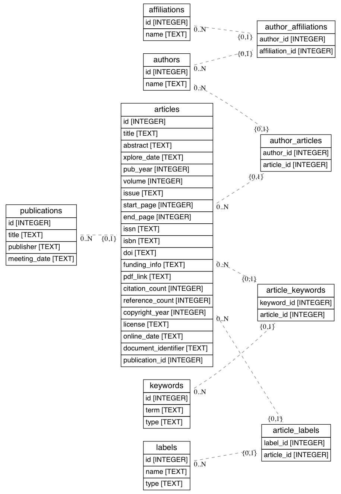

# Overview

A brief LDA topic analysis for SGSMA lit review.  

`LDA Topic Analysis.ipynb` is the primary notebook and should be run first to view results and generated saved model data.  The DAN classifier didnt work out and can be ignored although has been left in for review.

# Setup

If using Anaconda, you are probably all set for requirements.  Otherwise please use the provided `requirements.txt` file to load dependencies using `pip`.

    pip install -r requirements.txt

# Database

To parse the CSV files into a SQLite database, use the `scripts/wrangle.py` script. For more information how to use it, run the script with the `--help` flag. The extracted database can also be provided upon request.

The database wrangling is not perfect, and a number of errors occur that violate the normalization constraints. See a report of the wrangling errors below for the current dataset. Note that a lot of these errors can be cleaned up with some data wrangling (e.g. case normalization, white space normalization, etc.) but that was beyond the scope of the first extraction.

The schema of the database is as follows:

This schema is not set into stone and can be adapted and the database re-wrangled as necessary.

Currently the database contains the following tables and row counts:

| Table               |   Rows |
|:--------------------|-------:|
| affiliations        |  12458 |
| article_keywords    | 248341 |
| article_labels      |   9447 |
| articles            |   9767 |
| author_affiliations |  31437 |
| author_articles     |  36013 |
| authors             |  16116 |
| keywords            |  88002 |
| labels              |     56 |
| publications        |   2747 |

## Wrangling Errors

Errors are identified by JSON output of the wrangling script (for easy parsing and data retrieval). The error types discovered were as follows:

| Error                               |   Count |
|:------------------------------------|--------:|
| duplicate keywords                  |     899 |
| could not lookup article for label  |     296 |
| non-unique author names for article |      94 |
| could not assign label to article   |      75 |
| could not insert article            |      51 |
| Total                               |    1415 |

Duplicate keywords is a non harmful error, for example if author keywords includes the term "ZigBee" twice. Could not insert article is a bit more worrying, it means that a unique constraint was violated (e.g. between title and publication year). Most of the time this was for the document title "Table of Contents".

One issue that we have with this dataset is non-unique author names (e.g. Y. Liu appearing twice in each article). I assume this is two different people but we have no way of identifying which is which, particularly across documents. Therefore in the case that the same name appears twice on an author list, I've simply appended a numeric suffix to the name (e.g. Y. Liu (2)).

Label assignment has two issues: one where the article cannot be looked up by title/publication year and one where a label is assigned twice (possibly because of duplicates in the dataset). The wrangling script does nothing but ignore these errors for now.
